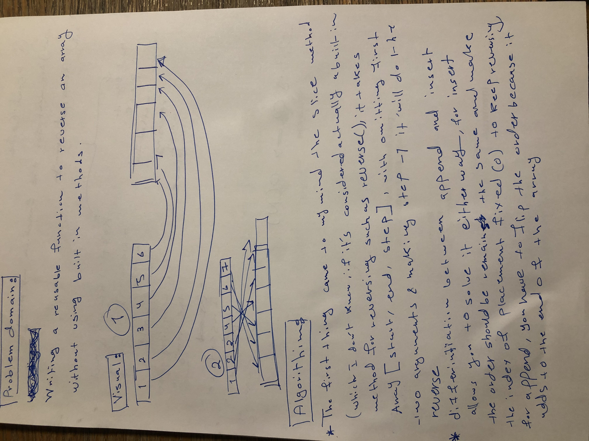
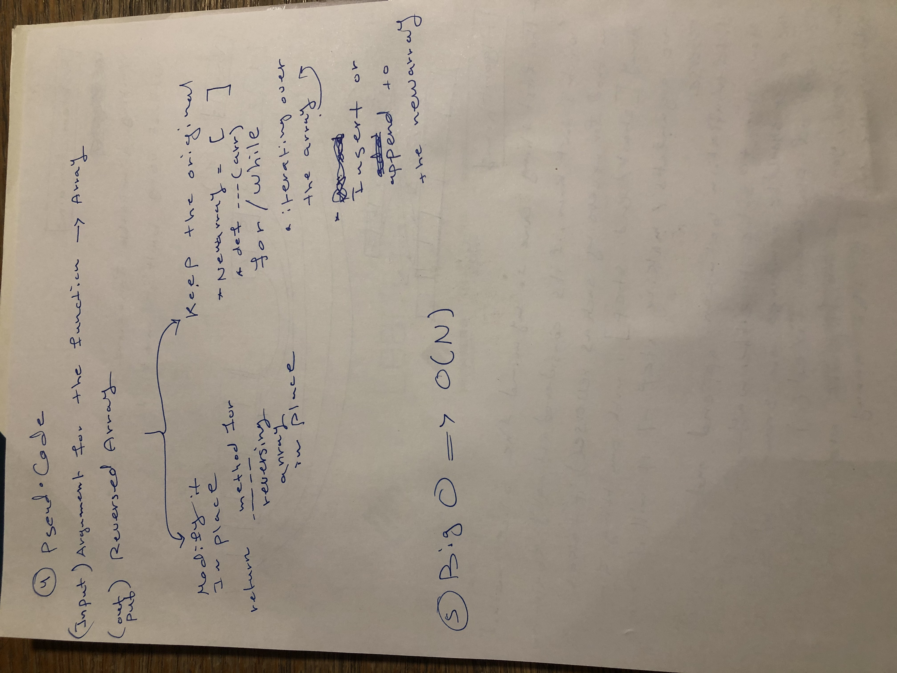
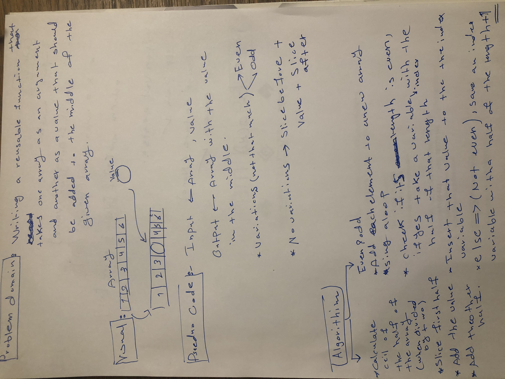
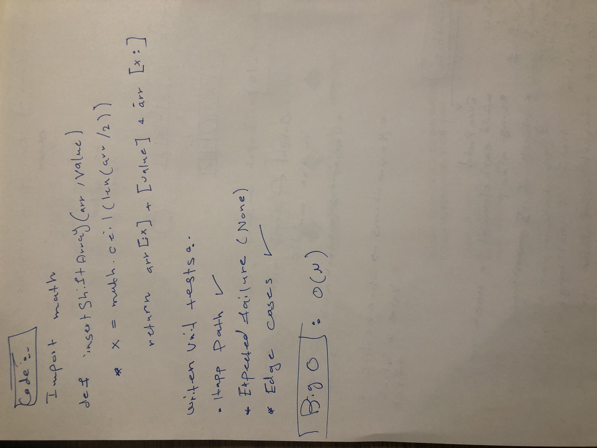
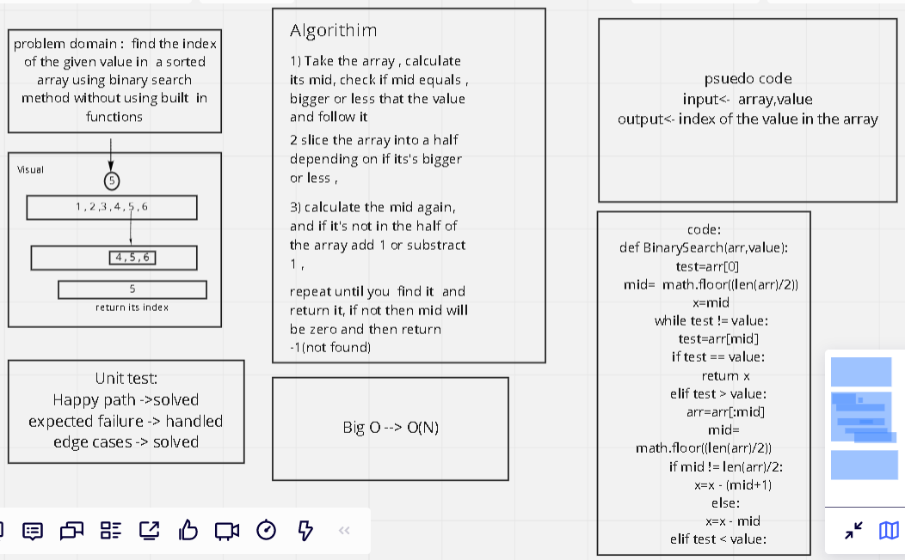

# Data Structures and Algorithms

See [setup instructions](https://codefellows.github.io/setup-guide/code-301/3-code-challenges), in the Code 301 Setup Guide.

## Repository Quick Tour and Usage

### 301 Code Challenges

Description | Link
---------|--------
Code-Challenge01 |[forEach](./code-challenges/challenges-01.test.js)
Code-Challenge02 |[Call by Reference,Value](./code-challenges/challenges-02.test.js)
Code-Challenge03 |[Sort](./code-challenges/challenges-03.test.js)
Code-Challenge04 |[Regex1](./code-challenges/challenges-04.test.js)
Code-Challenge05 |[Splice , Slice , Join , Split](./code-challenges/challenges-05.test.js)
Code-Challenge06 |[Object.keys,values,entries ](./code-challenges/challenges-06.test.js)
Code-Challenge07 |[Map](./code-challenges/challenges-07.test.js)
Code-Challenge08 |[Filter](./code-challenges/challenges-08.test.js)
Code-Challenge09 |[Reduce](./code-challenges/challenges-09.test.js)
Code-Challenge10 |[Chaining Methods](./code-challenges/challenges-10.test.js)
Code-Challenge11 |[Regex2](./code-challenges/challenges-11.test.js)
Code-Challenge12 |[Two-Dimensional Arrays](./code-challenges/challenges-12.test.js)
Code-Challenge13 |[Includes , every , substring , charAt](./code-challenges/challenges-13.test.js)

### 401 Data Structures, Code Challenges

- Please follow the instructions specific to your 401 language, which can be found in the directory below, matching your course.

Description | Link
---------|--------
Code-Challenge01 |[Reverse-Array](./python/code_challenges/array_reverse/array_reverse.py)
Code-Challenge01 |[Shift-Array](./python/code_challenges/array_shift/array_shift.py)

---------------------------
# Reverse an Array

## Challenge Summary
a function that reverse an array without using built-in method such as reverse()

## Approach & Efficiency
I took advantage of len() multiple times, for , while , append , insert.

## Solution

-----------------------

# Array Shift

## Challenge Summary
Manipulate the array by specifically adding values to its middle

## Challenge Description
a function that takes an array of numbers and a value as an arguments , add that value to the middle of the array

## Approach & Efficiency
two approaches ,one depending on the length of the array if it's even or odd(longer solution) . second one that takes advantage of the ceiling of the half and slice the array into two parts between the value which sets in the middle.

## Solution

# Binary Search

## Challenge Summary
find the index of a value in a sorted array without using built in methods

## Challenge Description
a function that takes an array of numbers and a value as an arguments , find the index of that value in the array by calculating mid , figure out if the value equals, higher , less than the mid and go towards it , each time the mid is calculated the array is halved , and if the mid doesn't equal half if array add or subtract 1, keep iterating all they way  till finds it and returns it, else then the mid becomes 0 and return -1.

## Approach & Efficiency
described above.
Efficiency : Checked with any other types than numbers , take all types of numbers , tested for each case (Happy path , expected failure , edge cases)

## Solution

# Linked list

# Challenge Summary
Define a linked list class with two methods insert and includes.

## Whiteboard Process
N/A

## Approach & Efficiency
if else statement for the insert where if contains while loop , regarding includes it's an if statement inside a while loop.

# Linked list insertion

# Challenge Summary
add new methods that insert nodes in different places in the linkedlist , append which is opposite of insert , insert after and insert before.

## Whiteboard Process
N/A

## Approach & Efficiency
insert before and insert have nearly the same concept of algorithm ,  which is loop over the linkedlist to search for that certain node then change the .next value for both the new node and the current node for inserting before or after , for inserting at the end it will loop over the end of the linkedlist then insert the node and change the .next for the current node.
