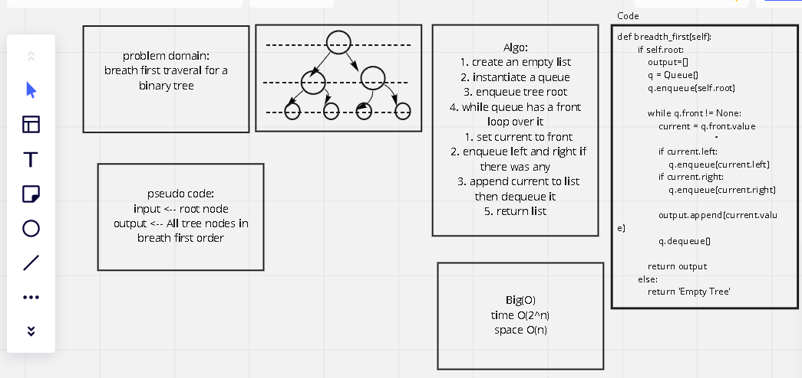
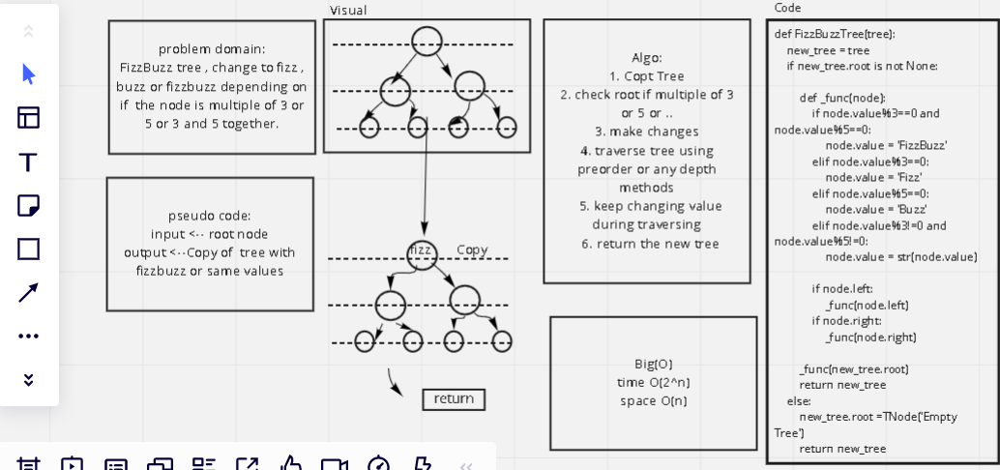
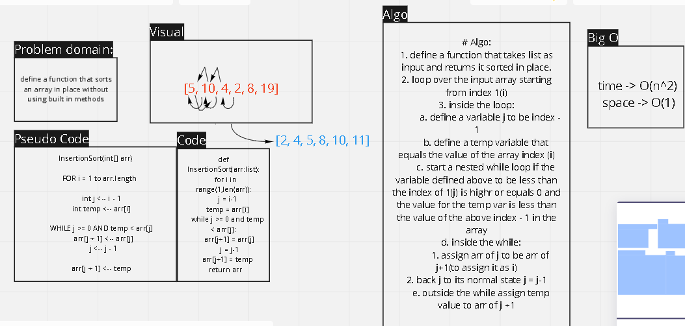
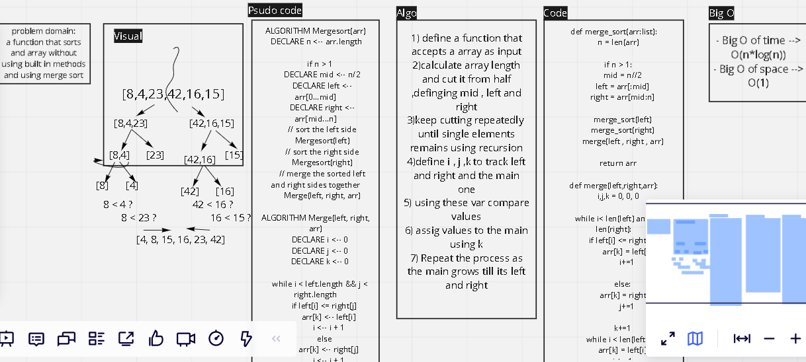
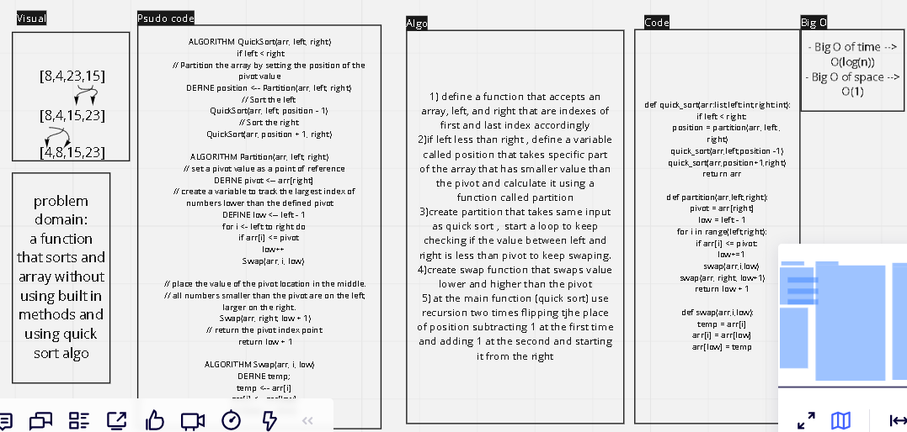
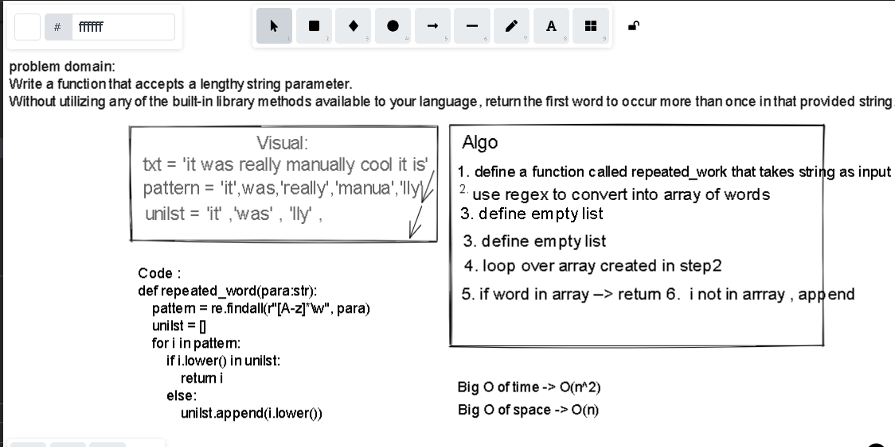

# Data Structures and Algorithms

See [setup instructions](https://codefellows.github.io/setup-guide/code-301/3-code-challenges), in the Code 301 Setup Guide.

## Repository Quick Tour and Usage

### 301 Code Challenges

Description | Link
---------|--------
Code-Challenge01 |[forEach](./code-challenges/challenges-01.test.js)
Code-Challenge02 |[Call by Reference,Value](./code-challenges/challenges-02.test.js)
Code-Challenge03 |[Sort](./code-challenges/challenges-03.test.js)
Code-Challenge04 |[Regex1](./code-challenges/challenges-04.test.js)
Code-Challenge05 |[Splice , Slice , Join , Split](./code-challenges/challenges-05.test.js)
Code-Challenge06 |[Object.keys,values,entries ](./code-challenges/challenges-06.test.js)
Code-Challenge07 |[Map](./code-challenges/challenges-07.test.js)
Code-Challenge08 |[Filter](./code-challenges/challenges-08.test.js)
Code-Challenge09 |[Reduce](./code-challenges/challenges-09.test.js)
Code-Challenge10 |[Chaining Methods](./code-challenges/challenges-10.test.js)
Code-Challenge11 |[Regex2](./code-challenges/challenges-11.test.js)
Code-Challenge12 |[Two-Dimensional Arrays](./code-challenges/challenges-12.test.js)
Code-Challenge13 |[Includes , every , substring , charAt](./code-challenges/challenges-13.test.js)

### 401 Data Structures, Code Challenges

- Please follow the instructions specific to your 401 language, which can be found in the directory below, matching your course.

Description | Link
---------|--------
Code-Challenge01 |[Reverse-Array](./python/code_challenges/array_reverse/array_reverse.py)
Code-Challenge01 |[Shift-Array](./python/code_challenges/array_shift/array_shift.py)

---------------------------
# Reverse an Array

## Challenge Summary
a function that reverse an array without using built-in method such as reverse()

## Approach & Efficiency
I took advantage of len() multiple times, for , while , append , insert.

## Solution

-----------------------

# Array Shift

## Challenge Summary
Manipulate the array by specifically adding values to its middle

## Challenge Description
a function that takes an array of numbers and a value as an arguments , add that value to the middle of the array

## Approach & Efficiency
two approaches ,one depending on the length of the array if it's even or odd(longer solution) . second one that takes advantage of the ceiling of the half and slice the array into two parts between the value which sets in the middle.

## Solution

# Binary Search

## Challenge Summary
find the index of a value in a sorted array without using built in methods

## Challenge Description
a function that takes an array of numbers and a value as an arguments , find the index of that value in the array by calculating mid , figure out if the value equals, higher , less than the mid and go towards it , each time the mid is calculated the array is halved , and if the mid doesn't equal half if array add or subtract 1, keep iterating all they way  till finds it and returns it, else then the mid becomes 0 and return -1.

## Approach & Efficiency
described above.
Efficiency : Checked with any other types than numbers , take all types of numbers , tested for each case (Happy path , expected failure , edge cases)

## Solution

# Linked list

# Challenge Summary
Define a linked list class with two methods insert and includes.

## Whiteboard Process
N/A

## Approach & Efficiency
if else statement for the insert where if contains while loop , regarding includes it's an if statement inside a while loop.

# Linked list insertion

# Challenge Summary
add new methods that insert nodes in different places in the linkedlist , append which is opposite of insert , insert after and insert before.

## Whiteboard Process
N/A

## Approach & Efficiency
insert before and insert have nearly the same concept of algorithm ,  which is loop over the linkedlist to search for that certain node then change the .next value for both the new node and the current node for inserting before or after , for inserting at the end it will loop over the end of the linkedlist then insert the node and change the .next for the current node.

# Linked list find a value from the end

# Challenge Summary
a function that finds a value from a linked list which start the index counting from the last node to the first

## Whiteboard Process
N/A

## Approach & Efficiency
convertig to normal list through looping over the linkedlist by assigning its values to a variable.

# Linked list zip

## Challenge Summary
Zip the two linked lists together into one so that the nodes alternate between the two lists and return a reference to the head of the zipped list.

## Challenge Description
we should Chain two linkedlist by taking 1 value from each and link them together without creating new linkedlist

## Approach & Efficiency
looping till both ll hit none and appending item (described in details in white-board)
space -> O(1)
time -> O(2n)

## Solution

# Stack and Queues

## Challenge Summary
Create stack and queue with all its essential methods

## Approach & Efficiency
create a Node class that creates the node , then create a class for Stack with a top of None when instantiating , adds push , pop , isEmpty , peek and other methods to it , and the same for queue.

## Whiteboard process
N/A

# Stack with queues

## Challenge Summary
Create a queue that consists of two stacks

## Approach & Efficiency
Create a PseudoQueue class.this PseudoQueue class will implement our standard queue interface (the two methods listed below), but will internally only utilize 2 Stack objects.

enqueue(value) which inserts value into the PseudoQueue, using a first-in, first-out approach.
dequeue() which extracts a value from the PseudoQueue, using a first-in, first-out approach.

## Whiteboard process
N/A

# Animal Shelter
Create a class called AnimalShelter which contains only dogs and cats. The shelter operates using a first-in, first-out approach. And Data can be recognized if a Dog or Cat

## Challenge Description
Implement the following methods:
- enqueue(animal): adds animal to the shelter.
- animal can be either a dog or a cat object.
- dequeue(pref): returns either a dog or a cat.
- If pref is not "dog" or "cat" then return null.

## Approach & Efficiency
enqueue(animal) is just a normal enqueue that appends to the Queue , dequeue(pref) it will check for front if not none it will loop on current.next until it finds it

## Solution
- Problem domain : Create a class called AnimalShelter which contains only dogs and cats. The shelter operates using a first-in, first-out approach. And Data can be recognized if a Dog or Cat

- Algorithim for dequeue
1. check kind if none , if yes return the front
2. if not none assign the front to a variable
3. check front if it's equal to the value
4. if not , check the next
5. if not , assign current to next and check next
6. when equals save to a variable
7. assign the next for the current to the next after it
8. return variable

- pseudo code : n/a

- Big O
time: O(n)
space : O(1)

# Multi-bracket Validation

## Challenge Description
a function should take a string as its only argument, and should return a boolean representing whether or not the brackets in the string are balanced. There are 3 types of brackets:

Round Brackets : ()
Square Brackets : []
Curly Brackets : {}

## Approach & Efficiency
create your normal stack, then use your function to loop over the string and predict closing or opening and make decision based on it.

## Solution

# Trees

## Challenge Description
- Create a BinaryTree class, define a method for each: preOrder , inOrder , postOrder
- Create a BinarySearchTree class, define a method named add that adds a new node with value to tree. Define a method named contains that accepts a value, and returns a boolean indicating whether or not the value is in the tree at least once.

# Approach & Efficiency
- uses recursion in BinaryTree with big O(2^n)
- uses recursion in BinarySearchTree with big O(2^n)

#  Whiteboard process
n/a

# API
- preOrder,inOrder and postOrder:
1. create an empty array
2. It loops over the tree by going to the root
3. append if preorder goes to the left node if existed and use recursion
4. append if inorder then go to right if existed and uses recursion
5. append if postorder

- Add and contains
Add :
1. assigns root if it does not exist, else assigns current as root
2. check if it is equal and do comparison with the current and add to it if doesn't exist, else will navigate to the left or right

Contains: Same as Add

# Find Maximum Value in Binary Tree

## Challenge Description
Find the Maximum Value in a Binary Tree without using built ins methods.

## Approach & Efficiency
define a max attribute that is equal to the root ,  then iterate over the tree while comparing

Big O of time --> O(2^n) Big O of space --> O(1)

## API
1. define a max attribute that is equal to the root
2. use preOrder methods to iterate over tree Nodes values
3. compare with the value saved in max then replace it if it is bigger
4. after the recursion ends we will have the maximum value in the tree
5. return it

=======
# Breadth-first

## Challenge Description
Write a breadth first traversal method which takes a Binary Tree as its unique input. Without utilizing any of the built-in methods available to your language, traverse the input tree using a Breadth-first approach, and return a list of the values in the tree in the order they were encountered.

## Approach & Efficiency
1. Create an empty list
2. append tree node values when you dequeue the node you enqueued to the new queue we created

- Big O
time --> O(2^n)
space --> O(n)

## Whiteboard process

# FizzBuzz Tree

## Challenge Description
Write the fizzBuzz Tree function without using build in functions
- takes a k-ary tree as an argument
- If the value is divisible by 3, replace the value with “Fizz”
- If the value is divisible by 5, replace the value with “Buzz”
- If the value is divisible by 3 and 5, replace the value with “FizzBuzz”
- If the value is not divisible by 3 or 5, simply turn the number into a String.

## Approach & Efficiency
copy the tree and used the depth method traversal while changing values of nodes

Big O of time --> O(2^n) Big O of space --> O(n)

## Whiteboard process

# Insertion Sort

## Challenge Description
Trace the pseudo code that writes a function to sort an array without utilizing built in methods

## Approach & Efficiency
nested loops . outer loop , loop over the array length starting from 1 while the nested one is a while loop traverse the array each time the temp variable(value of i in arr) is less than the value of j in the array.

- Big O of time --> O(2^n)
- Big O of space --> O(1)

## Whiteboard process

# Merge Sort

## Challenge Description
Trace the pseudo code that writes Merge sort algorithm which works on the principle divide and conquer, Merge sort repeatedly breaks down a list into several sublists until each sublist consists of a single element and merging those sublists in a manner that results into a sorted list.

## Approach & Efficiency
Divide the input array from the mid into right and left ,keeps going repeatedly until each element is single to start comparing and merging single elements in the right order and reassign values again in order using recursion.

- Big O of time --> O(n*log(n))
- Big O of space --> O(1)

## Whiteboard process

# Quick Sort

## Challenge Description
Trace the pseudo code that writes quick sort algorithm that sorts an array without utilizing built in methods.

## Approach & Efficiency
choosing a 'pivot' element from the array and partitioning the other elements into two sub-arrays, according to whether they are less than or greater than the pivot. The sub-arrays are then sorted recursively.

- Big O of time --> O(log(n))
- Big O of space --> O(1)

## Whiteboard process

# Hash Tables
Hashtables are a data structure that utilize key value pairs. This means every Node or Bucket has both a key, and a value.
The basic idea of a hashtable is the ability to store the key into this data structure, and quickly retrieve the value. This is done through what we call a hash. A hash is the ability to encode the key that will eventually map to a specific location in the data structure that we can look at directly to retrieve the value.

## Challenge Description
Implement a Hashtable with the following methods hash,add,get,contains.

## Approach & Efficiency
create a list with 1024 None elements, whenever we add a value it will check if it's existed in the location, if there is not(none) it will create a linked list and insert to it, else it will add to the existing linked list.

Big O of time --> O(1)
Big O of space --> O(1)

# API
- hash method that is being used by other methods to know values' location.
- add method that takes in the key & value , add them to their location.
- get method that takes in the key, returns the value from the table.
- contains method that takes in the key, returns a boolean if the key exists in the table.

# Repeated Word

## Challenge Description
Find the first repeated word in a book , paragraph or any text.

## Approach & Efficiency
using regex to generate array of words (findall), loop over it and check , if it's in the empty list , return it. else append to the empty list.

- Big O of time --> O(n^2)
- Big O of space --> O(n)

 # Whiteboard process

# Tree Intersection

## Challenge Description
Find common values between two binary trees

## Approach & Efficiency
using preorder method in each tree which traverse the tree and returns an array , save these two array ,define an empty array called common_values,  iterate over array 1 and check if it values is existing in array 2 , if yes append to the empty list, later check if length of the common_values array defined above is bigger than 0 , if yes return it , no , then return no common values

- Big O of time --> O(n)
- Big O of space --> O(n)

 ## Whiteboard process
- The approach above is self-explanatory as algorithm and Big O  , code is documented and straight-forward using proper function and variable's names and it's 4:00AM , isn't it? ---> [Tree intersection](python/code_challenges/tree_intersection/tree_intersection.py)

# Left Join

- LEFT JOIN returns all rows from the left table, even if there are no matches in the right table. This means that if the ON clause matches 0 (zero) records in the right table; the join will still return a row in the result, but with NULL in each column from the right table.
- This means that a left join returns all the values from the left table, plus matched values from the right table or NULL in case of no matching join predicate.

## Challenge Description
Implement a simplified LEFT JOIN for 2 Hashmaps

## Approach & Efficiency
1. loop over the first hashmap and
2. define an empty array, appends its key and values into an empty array ,
3. then for every key (i[0] which is the key in the inner array)
4. do a check if the other hashmap contains one of these keys ,
5. if yes append the value for the inner array, if no append none
6. return the array defined above in step 2.

- Big O of time --> O(n^2)
- Big O of space --> O(n)

## Whiteboard process
- The approach above is self-explanatory as algorithm and Big O  , code is documented and straight-forward using proper function and variable's names
[Left join](python/code_challenges/left_join/left_join.py)

# Graphs
- A graph is a non-linear data structure that can be looked at as a collection of vertices (or nodes) potentially connected by line segments named edges

## Challenge Description
- Implement your own Graph. The graph should be represented as an adjacency list

## Approach & Efficiency
Docs Strings are supplied with comments here ,  [Graph](python/Data_Structures/graph/graph.py)

Big O of time --> O(n^2)
Big O of space --> O(n)

## API
add_node(): Adds a new vertex(node) to the graph, Takes in the value of that vertex and Returns the added node

add_edge(): Adds a new edge between two vertices in the graph along with weight if supplied(optional), Takes in the two nodes to be connected by the edge Both vertices should already be in the Graph to not throw key Error

get_nodes(): Returns all of the vertices in the graph as a list

get_neighbors(): Returns a collection of edges connected to the given vertex using get method for dictionary built in method, Takes in a given vertex along with the weight of the connection.

size(): Returns the total number of vertices in the graph

Breadth_first_search : Extra method which traverse the graph using bfs and call any function on it.
