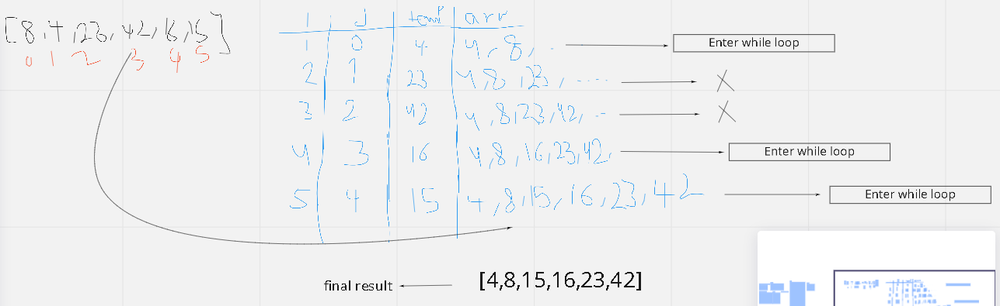

# Selection Sort

Insertion sort is a sorting algorithm in which the elements are transferred one at a time to the right position. In other words, an insertion sort helps in building the final sorted list, one item at a time, with the movement of higher-ranked elements. An insertion sort has the benefits of simplicity and low overhead

## PseudoCode:

InsertionSort(int[] arr)

    FOR i = 1 to arr.length

      int j <-- i - 1
      int temp <-- arr[i]

      WHILE j >= 0 AND temp < arr[j]
        arr[j + 1] <-- arr[j]
        j <-- j - 1

      arr[j + 1] <-- temp

## Trace

Sample Array: [8,4,23,42,16,15]

Each pass is traced as in the table below:

## Efficiency:
- Time: O(n^2)
The basic operation of this algorithm is comparison. This will happen n * (n-1) number of times…concluding the algorithm to be n squared.
- Space: O(1)
No additional space is being created. This array is being sorted in place…keeping the space at constant O(1).
